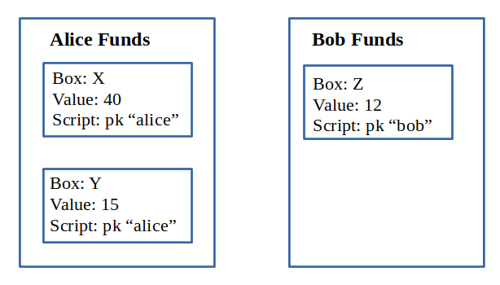
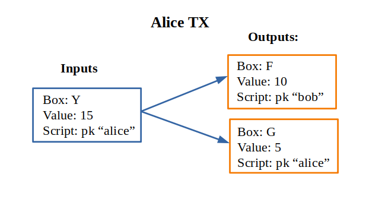
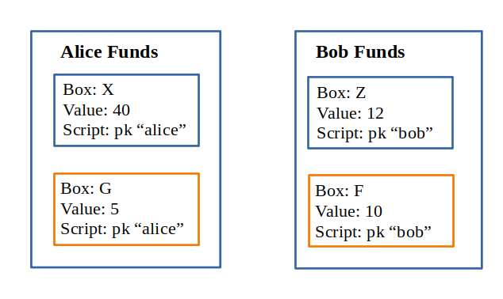
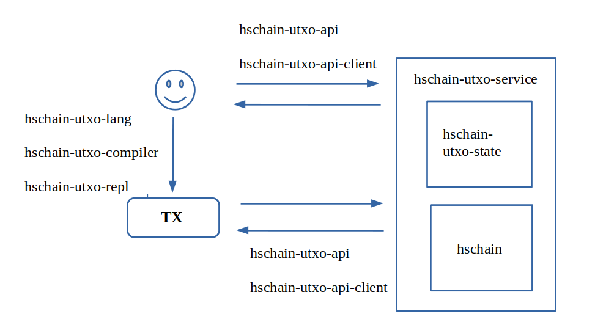

Introduction
============================

Hschain-utxo is a framework to create blockchains based on UTXO-model 
with rules that are defined with smartcontracts. 
It runs on top of hschain consensus protocol.

To define smartcontracts hschain-utxo uses special language that is inspired by ErgoScript.
The framework consists of several parts:

* the language for smartcontracts 
* interpreter for the language to try out ideas
* service to run blockchain
* client to post transactions and query useful information with API

Language of smart contracts
----------------------------------------------

Language of smartcontracts is staticly typed higher-order functional programming language
with predictable time of exectuion and zero-knowledge prooves of the ownership
of the values. It adapts powerful functional programming paradigm to the requirements of the safe, fast and predictable
execution of the scripts on the blockchain. 

Main features of the language:

* Language operates on the flexible UTXO-model which excludes double spending. 
  The scripts protect values from being spent and execution of transaction 
  that proves ownership of the values creates new protected inputs.

* Ownership of the values is bases on Sigma-protocols. Sigma-protocols allow the
  user to create intricate conditional rules for proving the ownership. Instead
  of fixed model of ownership we can devise our own rules. Rules are arbitrary boolean expresisons.
  It makes system flexible and provides the user with tools to create rules suitable 
  for a specific task.

* Alongside with Sigma-protocols we can use Bitcoin-like signatures. There are primitives
  for single ownership and multi-signatures.

* Rules of the ownership are zero-knowledge prooves of the private-key ownership. 
  The proove validation does not compromise the owner of the key and the key itself.

* Ownership prooves can depend on the current state of the blockchain. It provides the
  user with means to create rules that dpeend on time of execution and create time-bounded contracts.

* To make termination predictable we prohibit usage of recursion. 
  User can not create recursive functions and recursive types. 
  It restricts the language but nonetheless intricate behaviours can be achieved with
  sequence of transactions. It solves the problem of termination without the need
  to follow more intricate models like GAS-usage or artificial restriction on 
  the number of executed instructions which are not obvious for the user.

* Scriping language is a high level functional programming language.
  For fast execution it is compiled to low-level language.

* Language is staticly typed with automatic type-inference and type-checking. It protects user from 
  many posible errors and increases the safety level. 

Smart contracts are used to protect UTXOs from illegal spending. 
To define what is legal we have a language. It encodes conditions for protection of the values in UTXOs.
Our language is based on ErgoScript. For now it's typed lambda-calculus with 
support for sigma-protocols. Sigma-protocols define a way to protect the values
with cryptographic algorithms. Sigma-protocols let us prove that user owns private key 
without exposure of the private key itself.

Let's look at example of the simplest script::

   pk alice

``pk`` is a function that evaluates to true only if user can prove that he or she
is owner of the alice secret key.

Also we can use conditions and boolean operators::

   pk alice || (pk bob && getHeight > 100)

In this transaction Alice can grab the value or Bob can have it if 
the height of the blockchain is greater than 100.

UTXO-model and smartcontracts
------------------------------------------

Unspent Transaction Output (UTXO) model describes exchange of values. 
It was invented for Bitcoin blockchain
and successfully implemented there. It allows us to model exhange 
of any values in quite smart way. 

Suppose that user holds some amount of values and we want to transfer value
from one user to another. The value is represented 
by UTXO that can become an input for the future transaction.
If Alice wants to send 10 coins to Bob she can use her UTXO as input and
create another UTXO for Bob that will contain 10 coins. The UTXO is often protected
by the user signature. So in order to spend the transaction we need to prove that
we hold the value for this output. 

Here is the state of the Blockchain prior to transaction:

We can see that Alice has two boxes with values and Bob has only one. 
Each box has unique identifier, value and script that protects the value
The ownership by the user is encoded with the script. In the system we have 
no users such as Alice or Bob. We have only keys and prooves of ownership.

Let's suppose that Alice wants to send 10 coins to Bob. Bob sends his public key to Alice.
She creates a transaction with her ``Y`` box as input and creates two boxes as output. 
One box for Bob wich holds 10 coins and protects them with Bob's public key. 
The second box is for Alice to send back the remainder of the value from the original Box.
By the rule sum of the inputs should be equal to the some of the outputs,
otherwise transaction is considered to be invalid. Let's look at the Alice's transaction:

After that Alice prooves with her key that she holds the Box ``Y``. The TX is 
validated and commited and as a result it destroys the Box ``Y`` and creates
two new Boxes ``F`` and ``G`` that now can be used as inputs to other transactions.
Alice sends the identifier of the box ``F`` to Bob so that he can use it.
Identifier of the box is determined as a hash of content of the box and metadata (TX that
originated the Box and the identifier of the TX-output which references the box).
In this example scripts are very simple but they 
can be programs on their own to encode more complex scenarios. 
Let's look at the state of blockchain after TX was approved:

Once UTXO is spent it is destroyed and in place of it we have new UTXOs.
That's how smartcontracts work. We use UTXOs in the blockchain as inputs
check conditions in the smartcontract and if it holds true we destroy
inputs and substitute them with outputs. 

**Smart contract**
   Is a script that evaluates to true or false. It defines the rules to spend UTXOs.

**Transaction**
   Transaction tries to use UTXOs that exist in the system and turn them to another UTXOs.
   TX takes in UTXOs of the blockchain and environment variables (like height of the blockchain)
   that checks condition and if it evaluates to true it destroys the inputs and produces
   new UTXOs as outputs.
 
**Unspent transaction output (UTXO)**
   Box that contains a value that can be used as input for transaction
   and it is protected by the script (smartcontract). It can define rules
   for smartcontracts that try to spend the value.

**Block**
   Contains a list of transactions. It can be though of as execution of transaction in batch mode.
   If all transactions in the block are valid it is executed on the blockchain and it is
   said to be *commited*.

**Blockchain**
   For UTXO-model blockchain is a set of UTXOs that can be spent and global time
   of execution which corresponds to the number of commited blocks.

The structure of the project
------------------------------------------

The modules are separated for the parts:

* ``hschain-utxo-lang`` defines language of smartcontracts and model of execution and key terms
* ``hschain-utxo-compiler`` utility to compile scripts and prove ownership of the transaction
* ``hschain-utxo-state`` defines blockchain and rules to commit the blocks and transactions
* ``hschain-utxo-service`` is service to run a node
* ``hschain-utxo-api`` is API to interact with blockchain
* ``hschain-utxo-repl`` interpreter for the language 
* ``hschain-utxo-test`` test scripts to verify that everything works fine
* ``hschain-utxo-pow-node`` POW-node for blockchain
* ``hschain-utxo`` main application and utility tools (to generate genesis for instance)

Let's look at the scheme of project structure

User creates TXs with hschain-utxo-compiler. User compiles script language that is defined
in the package hschain-utxo-lang. He can use repl (hschain-utxo-repl) to try out ideas. 
User sends transactions to web-service (hschain-utxo-service) over API (hschain-utxo-api).
The service runs on top of hschain which handles transactions and manages state transactions.
State itself and the way to react to TXs is described in the package hschain-utxo-state.

Blockchain node
------------------------------------------------

Blockchain node runs a service that accepts postage of blocks by REST API.
It uses hschain as aconsensus algorithm to make commits consistent accross the
network. We can run the node like this::

  cabal new-run hschain-utxo-service

It accepts config and genesis see corresponding section for details.

API
------------------------------------------------

We can use REST API to post transactions and query useful information.
The clinets are defined in the module ``hschain-utxo-api`` see the corresponding section
for details. 

