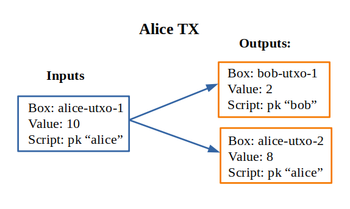

Quick start guide for language
========================================

The language for smart contracts is heavily insired with ErgoScript and Haskell.
So regarding the syntax we can use our haskell intuition in many circumstances.

Functions look like Haskell functions, but we use strict execution. They are applied with space defined with equal sign
or slash-lambda. Like in haskell we have ``if-then-else`` and ``let-in`` expressions.::

  > addTwo x = x + 2
  > addTwo 2
   4

Like in Haskell we have tuples. They are accessed with case-expressions::

   getThird (_, _, third) = third

   case pair of
      (a, b) -> a + b

Also we have lists with usual operators ``map`` (map over), ``fold`` (left fold), ``length`` (size of the vector), 
``++`` (concatenation) and many other handy functions. 

the script is a list of defenitions. It should contain
the function with name ``main`` which has type ``SigmaBool``. It is the result of the script.::

  one = 1
  two = 2

  check x = one + two == x

  main = toSigma (check 3)

The ``SigmaBool`` is a special type that uses Sigma-protocols as proof of the ownership.
Soon we are going to see some examples of them. In this script we use converter functions
``toSigma :: Bool -> SigmaBool``. It converts plain old booleans to sigma-expressions.

.. topic:: No recursion

   The termination of execution should be guaranteed for our language. 
   So the recursive functions are not allowed.

Ownership check - the heart of the language
----------------------------------------------------

The heart of the language is a function ``pk`` that checks for ownership:

.. function:: pk :: Bytes -> SigmaBool

   Check for ownership of private key.

It implements sigma-protocol. The transaction should have the field ``proof``
that lists all proofs for ownership of the keys. 

Here is the simple script to protect Bob's values::

  pk (bytes "bob-key")

In this line ``bob-key`` is a public key of the user. We convert text representation to bytestring
with built-in function ``bytes``. It protects the funds
from spending by other parties. But where do we get our keys?
We get public key from secret key. 

.. function:: bytes :: Text -> Bytes

   Special built-in word that let us write bytestring as plain text.

Secret and public keys
----------------------------------------------------

We can create the secret and public keys in two ways. One involves knowledge
of Haskell and another is lanuage agnostic. 
To create new secret key in Haskell we can use the function ``newSecret`` from the package
``hschain-utxo-lang`` and then we can get the public key out of secret with 
function ``getPublicKey :: Secret -> PublicKey``. 

Also we can create secret key with utility ``hschain-utxo-compiler`` and it's command ``secret``.
We can use it like this::
   
   > hschain-utxo-compiler secret --output bob-secret.txt

It creates new secret key and dumps it to the file ``bob-secret.txt``.
Then we can get the public key with command ``public-key``::

   > hschain-utxo-compiler secret --input bob-secret.txt --output bob-public-key.txt

It transforms secret key to public. If we ommit the option output it will dump public key
to stdout. This string we can use as the argument of the function ``pk`` to protect our funds. 

If we want to receive funds from another user we can give public key to her so that
she can submit transaction with the script::

  pk (bytes "our-public-key")

Conditional ownershhip
----------------------------------------------------

Also we can give money to Alice until certain time and later 
give it to Bob excluding Alice::
   
   time = 100

   main = 
         (pk alice &&* (getHeight <=* time) 
      || (pk bob   &&* (getHeight >*  time)

Operators with stars at the end like ``&&*`` or ``<*`` are lifted versions of
ordinary boolean operators to work with ``SigmaBool`` instead of ``Bool``.
For example let's look at the signatures::

  (&&*) :: SigmaBool -> SigmaBool -> SigmaBool

  (<*)  :: a -> a -> SigmaBool

  (==*)  :: a -> a -> SigmaBool

We can find out the signature in ``hschain-utxo-repl`` just like in ghci repl with command ``:type`` or ``:t`` for short::

  :t (<=*)

  (<=*) :: a -> a -> SigmaBool

Comparision operators are defined for all types (including user-types). 
Derivation of comparision operators is built in the language.

Transaction execution
-------------------------------------------

Let's look at how transaction is executed. Transaction has several components:

**Inputs**
   List of identifiers for exisiting UTXOs in the blockchain with metadata on how to prove
   the ownership of the input/

**Outputs**
   List of produced UTXOs. They are added to blockchain if TX is valid.
   The input boxes are destroyed.

**Data-inputs**
   List of identifiers for existing UTXOs that are used as global scope constants
   for execution of the transaction. They are not destroyed after TX-execution
   and values of them can not be spent to outputs. This is the main difference
   between inputs and data-inputs.

Inputs contain useful information for TX-execution:

**Identifier of the input box**
  Reference to box that we want to spend. Identifier of the box in the blockchain.
  Note that we can sign TX with reference to the box that is not yet present in the 
  block chain and sign it. This scenario can be useful in the omplementation of lightning networks.

**Arguments**
  Arguments for box script. It is represented as bytestring that can hold any serialised value
  of the language (including user types). Serialisation is built-in the language for all types. 

**Proof**
  Signed sigma-expression that proofs the ownership.

**Signaiures**
  Vector of signatures. This is used with bitcoin-style signatures. 

**Signature mask**
  Mask of which inputs and outputs are signed. We can sign all inputs and outputs but also
  we can leave some iputs or outputs open for change.

User posts transaction in three steps. 

* User creates transaction with empty proof and calls API method ``api/tx-sigma/get``. This
  method produces sigma-expression that is the result of evaluation of transaction in 
  the current state of block-chain.

* User creates a proof of ownership if she can for received sigma-expression.

* User uses this proof with transaction and post it again but with method ``api/tx/post``.
  If everything is ok, verifier checks the transaction and accepts it.

The engine reads all inputs from the blockchain and creates the total
script for transaction by and-concatination of all scripts in inputs.
If all input scripts are valid in the current context of transaction and blockchain
then transaction is valid and we destroy input UTXOs and add output UTXOs to the
blockchain.

Beside the check of proof there are other conditions:

* The sum of inputs should equal to the sum of outputs.

* Outputs should contain valid scripts, that are evaluated to ``SigmaBool``.
   They have function main with no arguments that produces ``SigmaBool``. 

In the following sections we are going to look at several examples. 

Simple money exchange script
---------------------------------------------

Let's look at the very simple scenario. Alice gives 2 coins to Bob.
And Bob gives 5 to Alice. Let's see how it can be implemented.

Suppose that Alice has UTXO with 10 coins named ``alice-utxo-1`` that is protected by the script::

  pk alice

To send 2 coins to Bob she creates a TX that includes her UTXO as input,
provides proof of her ownership and creates two UTXOs. 
The first UTXO gives money to Bob. It has 2 coins of value and contains script::

  pk bob

The second UTXOs is cashback for Alice, she gives change of 8 coins to herself::

  pk alice

In the UTXO model we have to spend all values of the inputs, because inputs would be destroyed 
after TX confirmation. So we have TX such as::

   {
      "inputs": 
         [ { "id": "alice-utxo-1"                    
           , "args": {}
           , "proof": signed-sigma-expression
           , "sigs": []
           , "sigMask": {"SigAll": []}
           }
         ],
      "outputs": 
         [ { "id": "bob-utxo-1",
           , "value": 2,
           , "script": "pk (bytes bob-pub-key)",
           , "args": {} 
           }
         , { "id": "alice-utxo-2",
           , "value": 8,
           , "script": "pk (bytes alice-pub-key)",
           , "args": {}
           }
         ];
      "data-inputs": []
   }

This is slightly simplified version of TX. But we can get the idea.
TX is a json-object that contains the fields: "inputs", "outputs", "proof", "args", "sigs" and "sigMask". 
Value "SigAll" means that we sign all inputs and outputs.
The outputs is a list of UTXOs, each of them has fields "id", "value", "script" and "args".

To make real transaction we also need to compile the script. But here for simplicity of
explanation it's written in stright format.

Now suppose that Bob has UTXO with 4 coins. And he wants to give 5 coins back to Alice.
But also alice just gave him 2 coins, so he can use two UTXOs as inputs and create
2 UTXOs as outputs for Alice and cashback for himself:

.. image:: ../images/lang-quick-start/bob-tx.png
   :width: 700
   :alt: Bob Tx

Let's look at the code for transaction::

   {
      "inputs": 
        [ { "id": "bob-utxo-0"
          , "args": {}
          , "proof": signed-sigma-expression
          , "sigs": []
          , "sigMask": {"SigAll": []}
          }
        , { "id": "bob-utxo-1"
          , "args": {}
          , "proof": signed-sigma-expression
          , "sigMask": {"SigAll": []}
          }
        ],
      "outputs": 
         [ { "id": "bob-utxo-2",
           , "value": 1,
           , "script": "pk bob",
           , "args": {} 
           }
         , { "id": "alice-utxo-3",
           , "value": 5,
           , "script": "pk alice",
           , "args": {}
           }
         ];
      "proof": signed-sigma-expresision,
      "data-inputs": []
   }

It is enforced by the blockchain that sum of input values should be equal to sum of output values.

How to sign sigma-expression
---------------------------------------

To sign sigma expression first we need to get it. Sigma expression is kind of
boolean expression that can contain AND and OR operators in the nodes and ownership
pk-statements with public keys in the leafs. To get this expression we first need to 
call the API method ``api/tx-sigma/get`` with our transaction but we omit proof.

Once we get the expression. We can sign it with compiler command ``sign``::

  > hschain-utxo-compiler sign --secret secret.txt --expression sigma-expr.txt --tx tx.txt --output signed-sigma.txt

This command expects three inputs:

* ``--secret`` the file that contains secret key of the user

* ``--expression sigma-expr.txt`` the file that contains the ouptut of the API call to tx-sigma method.

  ``--tx tx.txt`` the file that contains serialised code for TX without a proof.

* ``--signed-sigma.txt`` the file to dump the output, i.e. signed sigma expression or proof of the ownership.

Pay for Cofee - delayed exchange
--------------------------------------------

Imagine that Alice wants to buy cofee from Bob and she wants to pay with our blockchain.
But she wants to be able to get the money back until certain amount of time from now.
So Alice wants to give the money to Bob. But bob can collect the money only after 20 steps
of blockchain. Up until that time Alice can get her money back.

To do it Alice can create UTXO with following script::

   timeBound = ... -- some number ahead of current height

   main = (pk alice &&* getHeight <* timeBound) 
       || (pk bob   &&* getHeight >=* timeBound)

XOR-game
--------------------------------------------

For XOR-game we have two players: Alice and Bob. 
Players guess numers 0 or 1. And if numers are the same alice wins
otherwise Bob wins. Let's suppose that both players give 1 coin for the game.
And the winner takes both of them. 

This example is taken from the paper on ErgoScript and adapted for our language.

To start the game Alice creates half-game script with value of 1 coin.
Then Bob joins and creates full game script with value of 2 coins. 
Alice creates a guess ``a`` and secret ``s`` also she computes ``k = hash (s <> a)``. 
She creates UTXO with value of 1 coin.
This box is protected by a script called the half-game script given below. Alice waits
for another player to join her game, who will do so by spending her half-game output and
creating another box that satisfies the conditions given in the half-game script.

Bob joins Alice’s game by picking a random bit b and spending Alice’s half-game output to
create a new box called the full-game output. This new box holds two coins and contains b
(in the clear) alongwith Bob’s public key in the registers. Note that the full-game output
must satisfy the conditions given by the half-game script. In particular, one of the conditions
requires that the full-game output must be protected by the full-game script (given below).

Alice opens k offchain by revealing s, a and wins if a = b. The winner spends the full-game
output using his/her private key and providing s and a as input to the full-game script.
If Alice fails to open k within a specified deadline then Bob automatically wins.

The full-game script encodes the following conditions: The Box arguments with 
names ``"guess"``, ``"publicKey"`` and ``"deadline"`` expected
to store Bob’s bit b, Bob’s public key (stored as a proveDlog proposition) and the deadline for Bob’s
automatic win respectively. The context variables with id 0 and 1 (provided at the time of spending
the full-game box) contain s and a required to open Alice’s commitnent k, which alongwith Alice’s
public key alice is used to compute ``fullGameScriptHash``, the hash of the below script::
  
  (s, a) = getArgs
  (b, bobDeadline, bob) = getBoxArgs getSelf

  main =  (pk bob &&* (getHeight >* bobDeadline))
      ||* (   (sha256 (appendBytes s (serialise (a :: Int))) ==* $(commitmentHash))
          &&* (   (pk $(alice) &&* (a ==* b))
              ||* (pk bob      &&* (a /=* b))
              )
          )

The above constants are used to create ``halfGameScript``::

  validBobInput b = (b == 0) || (b == 1)

  main = andSigma
        [ toSigma (validBobInput bobGuess)
        , sha256 (getBoxScript out) ==* $(fullGameScriptHash)
        , (length getOutputs ==* 1) ||* (length getOutputs ==* 2)
        , bobDeadline >=* (getHeight + 30)
        , getBoxValue out >=* (2 * getBoxValue getSelf) ]
    where
      out = getOutput 0
      (bobGuess, bobDeadline) = getBoxArgs out

Alice creates her half-game box protected by halfGameScript, which requires that the transaction 
spending the half-game box must generate exactly one output box with the following properties:
   
1. Its value must be at least twice that of the half-game box.

2. Its argument "guess" must contain a byte that is either 0 or 1. This encodes Bob’s choice b.

3. Its argument "deadline" must contain an integer that is at least 30 more than the height at which the box is generated. This will correspond to the height at which Bob automatically wins.

4. It must be protected by a script whose hash equals ``fullGameScriptHash``.

The game ensure security and fairness as follows. Since Alice’s choice is hidden from Bob when
he creates the full-game output, he does not have any advantage in selecting b. Secondly, Alice is
guaranteed to lose if she commits to a value other than 0 or 1 because she can win only if a = b.
Thus, the rational strategy for Alice is to commit to a correct value. Finally, if Alice refuses to
open her commitment, then Bob is sure to win after the deadline expires.

Create transaction and send it with API
---------------------------------------------

We can post the transaction over API. To do it we have to create TX as JSON object.
Every TX  is a JSON-object that contains following fields::

  { "inputs": [inBox1, inBox2]
  , "outputs": [box1, box2]
  , "data-inputs": [dataBox1, dataBox2]
  }

Inputs  contain the list of references to input boxes. 
Ouptuts contain boxes that are going to be produced after TX is validated.
Proof contains the signed sigma expression that we can get with compiler (see previous section). 
First we send the transaction to method ``api/tx-sigma/get`` then we receive
sigma-expression and prove it. And we supply this prove in the field ``proof``.
Args contains the map of key-value. It can be empty.

The sum of values of inputs should be equal to sum of values of outputs. 
For TX to be valid all conditions for scripts of the inputs should evalueate to true.
List of inputs should be non-empty.

Let's look at the value of the input box. It's JSON-object::

  {
      "id": "utxo",
      "proof": signed-sigma-expression
      "args": {},
      "sigs": [],
      "sigMask": { "SigAll": []}
  }

Let's look at the value of output box. It's JSON-object::

   {
      "id": "utxo",
      "value": 10,
      "script": "string with compiled script",
      "args": {},
   }

It contains UTXO identifier, amount of maney as a value, script and arguments.
The script is written in our language. But to get the final string for transaction we need
to compile it with compiler ``hschain-utxo-compiler``::

  cabal new-run hschain-utxo-compiler -- compile -i script.hs -o out.txt

if flag ``-o`` is omitted then the result is dumped to stdout. 
Then paste the output to the output box script field. We can save the TX to file ``tx.json``
and post the TX with following curl::

  curl -H "Content-Type: application/json"  --data @config/tx-example.json  localhost:8181/api/tx/post

Send with API in Haskell
---------------------------------------------------

With Haskell we can create transactions and post them with easy to use library.
We need libriaries ``hschain-utxo-lang`` to create value for transaction 
and library ``hschain-utxo-api-client`` to post the transaction.

Let's create a transaction and post it.
The transaction has type::
  
  -- | Type for transaction. It spends values from the input boxes and
  --   create output boxes.
  --
  --   Each input references another box and contains proof for complete
  --   transaction or sigma expression that should be proven when we
  --   assemble transaction. Proof will be missing if spend script
  --   evaluated to boolean.
  data GTx i o = Tx
    { tx'inputs  :: !(Vector (BoxInputRef i))
      -- ^ List of inputs
    , tx'outputs :: !(Vector o)
      -- ^ List of outputs
    , tx'dataInputs :: !(Vector BoxId)
      -- ^ List of inputs that we do not spend and use as constants in scope
    }

  type Tx = GTx Proof Box

   data Box = Box
      { box'id     :: !BoxId
      , box'value  :: !Money
      , box'script :: !Script
      , box'args   :: !Args
      }

  -- | Input is an unspent Box that exists in blockchain.
  -- To spend the input we need to provide right arguments and proof
  -- of reulting sigma expression.
  data BoxInputRef a = BoxInputRef
    { boxInputRef'id       :: BoxId
    -- ^ identifier of the box to spend
    , boxInputRef'args     :: Args
    -- ^ arguments for box script
    , boxInputRef'proof    :: Maybe a
    -- ^ proof for the script
    , boxInputRef'sigs     :: Vector Signature
    -- ^ signatures for the script. We have to exclude this field on computing TxId and on computing SigMessage
    , boxInputRef'sigMask  :: SigMask
    -- ^ mask of TX which defines the filter of inputs and outputs that we sign
    }
   
  newtype BoxId = BoxId { unBoxId :: Hash SHA256 }

  newtype Script = Script { unScript :: ByteString }

  -- | Signature mask. It defines what inputs and outputs
  -- are included in the message to sign.
  --
  -- Empty SigMask means sign all inputs and outputs.
  data SigMask = SigMask
    { sigMask'inputs     :: Vector Bool
    , sigMask'outputs    :: Vector Bool
    , sigMask'dataInputs :: Vector Bool
    } -- ^ Specify what inputs and outputs to sign
    | SigAll
    -- ^ Signs whole transaction (all inputs and outputs)

We need to create the value of type ``Tx``.
For creation of script we can use the module ``Hschain.Utxo.Lang.Compile`` 
(see function ``toCoreScript``) from the library ``hschain-utxo-lang`` or we can compile to string with
``hschain-utxo-compiler`` as in previous section and wrap result with ``Script``
constructor. In the latter case we can write script in text file.

Let's post it with the client. We can use the library ``hschain-utxo-api-client``.
We need method ``postTx``::

   import Hschain.Utxo.API.Client

   spec = ClientSpec
               { clientSpec'host     = "127.0.0.1"
               , clientSpec'port     = 8181
               , clientSpec'https    = False
               }

   call spec (postTx tx)

The answer is either error or structure with TX hash and debug-message::

   data PostTxResponse = PostTxResponse
      { postTxResponse'value :: !(Either Text TxHash )
      , postTxResponse'debug :: !Text }

